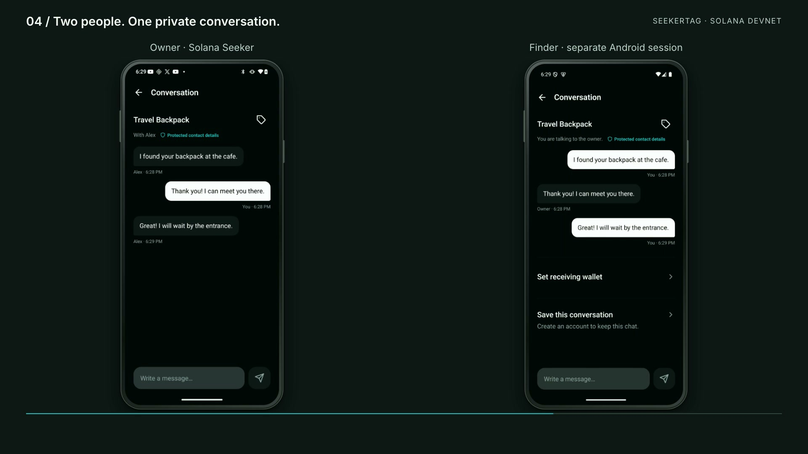

# SeekerTag

[](https://seekertag.vercel.app)

Lost & found for Solana Seeker: QR/NFC tags, private owner–finder conversations, and on-chain return rewards.

[Website](https://seekertag.vercel.app) · [App demo (2:46, English)](https://github.com/minikas/seekertag/releases/download/v1.0.0-clock-in/seekertag-seeker-demo-en.mp4) · [Pitch deck (PDF)](https://github.com/minikas/seekertag/releases/download/v1.0.0-clock-in/seekertag-pitch.pdf) · [Download Android APK](https://github.com/minikas/seekertag/releases/download/v1.0.0-clock-in/SeekerTag-preview.apk) · [CLOCK IN release](https://github.com/minikas/seekertag/releases/tag/v1.0.0-clock-in)

## Watch the app demo

[](https://github.com/minikas/seekertag/releases/download/v1.0.0-clock-in/seekertag-seeker-demo-en.mp4)

**[▶ Watch the 2:46 demo](https://github.com/minikas/seekertag/releases/download/v1.0.0-clock-in/seekertag-seeker-demo-en.mp4)** · [GitHub release](https://github.com/minikas/seekertag/releases/tag/v1.0.0-clock-in) · [English subtitles](presentation/video/seekertag-seeker-demo-en.srt) · [Editable video project](presentation/video/README.md)

Recorded on the updated app with English narration and captions: Seeker/Seed Vault sign-in, item creation, a 1 SKR test-token reward, QR and matching printable PDF, the NFC writing screen, lost status, incoming notification, two-device chat, receiving-address review, and Finish return directly in the conversation. The same reward is deposited and paid on Solana devnet: 0.95 test SKR to Testuser and a 0.05 test SKR service fee. See the [recording evidence](presentation/video/README.md#recording-evidence).

The preview APK is a standalone Android ARM64 build for Seeker, configured to use the public SeekerTag API; Metro and a local backend are not required. The reward implementation supports devnet, testnet, and mainnet, with one network configured per server. The documented demo uses devnet test tokens.

An **Android-only app focused on Solana Seeker**, built with Expo SDK 57 and React Native 0.86. QR/NFC tags help return lost items through private conversations without exposing the owner's contact details.

The project includes an Android app, a Node.js API with SQLite, and a separate marketing landing page. There is no iOS project or web version of the app. The API is required for two devices to share items, reports, and messages.

## Pitch deck

**[Read the 9-slide pitch (PDF)](https://github.com/minikas/seekertag/releases/download/v1.0.0-clock-in/seekertag-pitch.pdf)** · [Editable HTML](presentation/seekertag-pitch.html)

Updated September 20, 2026 with current app captures, SKR as the default reward currency, receiving-address review, and the completed devnet payout shown in the demo. The deck includes refund terms, dated market sources, and clickable links to the website, video, APK, repository, and [finalized transaction](https://explorer.solana.com/tx/3heFKF88UY3XhVxc5xbYtTT9jmLgTdMRmXmXMJPCnuaJZd5jtpD2quCUYdPyKp6ohp6YtSt835R9fVSXeyEGpPY6?cluster=devnet).

To present locally, open the HTML and use the arrow keys. To regenerate the PDF in Chrome, print with background graphics enabled, no headers or footers, and the CSS-defined 1280 × 720 page size. The cover shares the website’s current Home capture at `apps/landing/public/app-screen-en.png`; the conversation capture lives in `presentation/screens/`. Regenerate the PDF after changing either image.

## Landing page

`npm run dev:landing` starts the server at http://localhost:4320. The landing page lives in `apps/landing/public`, supports Portuguese, English, and Spanish, and uses a locally bundled i18next library without external fonts or API integration. Set `LANDING_PORT` to change the port.

`npm run build:landing` generates `apps/landing/dist`, ready for static hosting. To preview the output, run `npm run preview --workspace=@seekertag/landing`. The local server listens on loopback only and is not a production server.

The buttons show the app's development status. No public store link is configured. The phone displays the current app Home in English, with the notifications bell and Home, Conversations, and Items tabs fully visible. The same real Seeker capture (`app-screen-en.png`, from the September 20 demo’s `my-items.mp4` at 2.5 seconds) is shared by all three website languages and the pitch cover. The README hero is a fresh capture of the English website. The tag follows the app's PDF design, with a demo QR code that opens `seekertag:///` without linking to a real item. The landing page does not change the API's `/found` flow.

## Monorepo (Turborepo + npm workspaces)

Requires Node.js 24+ and npm 11.8.0. Run `npm ci` once at the repository root.

- `apps/mobile`: Expo 57 app, assets, plugins, EAS configuration, and mobile tests.
- `apps/api`: Node/SQLite API, tests, and local `.env`; the database lives in `apps/api/data/`.
- `apps/landing`: responsive, static marketing website, independent of the app.
- `packages/shared`: the `@seekertag/shared` package used by the app and API.
- `contracts`, `scripts`, and `artifacts`: Solana contracts, tooling, and build output at the repository root.

Existing commands remain available at the root: `npm run dev`, `npm run start`,
`npm run android`, `npm run api`, `npm run test:all`, `npm run build:android`, and the escrow/devnet tests.
`npm run dev` starts the API and Metro through Turbo; `npm run build` exports the Android bundle to
`artifacts/android-bundle`. Tests always run; type checking and bundling use Turbo's cache.
`EXPO_PUBLIC_*` variables and the app's `.env` files are included in the bundle cache key.
Development commands pass the terminal's environment variables to both processes.

To run commands directly in the app, use `cd apps/mobile` before `npx expo …`
or `eas …`; `app.json` and `eas.json` live in that directory. Root commands forward
options, for example `npm run start -- --clear` and `npm run android -- --device Seeker`.
After migration, start Metro once with `--clear`. Before reusing incremental native builds,
run `npm run build:android` without `--incremental` to refresh native paths.
Existing native directories and local artifacts were preserved.

Declare dependencies in the workspace that uses them. Add packages with
`npm install <package> --workspace=@seekertag/mobile` or `--workspace=seekertag-api`.
The single lockfile is `package-lock.json` at the root; do not install the API with `--prefix`.
Docker builds still run from the repository root.

## How it works

1. The owner signs in with a Seeker/Solana wallet, Google, or Apple; an account is created on first sign-in. Google/Apple require provider activation. The welcome screen shows an illustration and a Get started action; all three providers appear in a Gorhom bottom sheet.
2. The owner registers an item, generates its QR code, and shares/prints the PDF or writes an NFC tag.
3. The finder scans the tag using the installed SeekerTag app. **No account is required**, but the app must be installed.
4. The finder sends a report and chats with the owner. Conversation access is saved in the device's secure storage.
   To receive a reserved reward, the finder sets a receiving wallet directly in the conversation, pastes a Solana address, and reviews it before confirming. No Seeker phone, wallet connection, signature, or SeekerTag account is required for address entry. Connecting a compatible wallet remains optional. The address is fixed to that conversation after confirmation.
5. After receiving the item, the owner chooses **Finish return** in the conversation. For a reserved reward, the owner reviews the recipient and fee and signs with the deposit wallet. Conversations close and the item's history updates after the API confirms payment on the network.

The app also supports search, filters, editing, archiving/restoring items, marking items as lost, and transferring them to another account with identity confirmation. Archived items leave the main lists and appear under the Archived filter; their QR and NFC tags cannot receive new reports until restored. Wallet authentication uses Sign In With Solana through Mobile Wallet Adapter on Android.

## Categories, language, and appearance

In **My account → Categories**, create, rename, and delete categories, choosing an icon and color. The item form also provides access to category management without losing the draft. Each account starts with Backpack, Suitcase, Keys, Pet, Electronics, and Other. Categories belong to the account and persist in the API; deleting a default category does not make it reappear. If a category contains items, choose a destination category before deleting it. Items, QR codes, and conversations are preserved. Each account supports up to 50 categories.

In **My account → Language**, choose Portuguese, English, Spanish, or **Same as device** (default). Under **Appearance**, choose Light, Dark, or **Same as device**. Changes apply immediately and are saved on the device, including after closing the app. Unsupported device languages fall back to English. App text and PDF tags follow the selected language; user-written names, custom categories, and messages retain their original content.

The update migrates existing items to categories with stable IDs, preserving their QR codes and colors. Default categories use language-independent keys; renaming one turns it into a custom name.

## Former web features on Android

| Feature | App implementation |
|---|---|
| Registration, sign-in, sign-out, and recovery | Same screens and API; session stored in SecureStore |
| Create and edit items, category, private note, public message, and reward | Complete item form |
| Search, filters, and counters | Home counters open filtered lists; search available under View all |
| Mark as lost, archive, and restore | Tag details |
| QR codes, camera scanning, and manual entry | Native QR rendering and Expo scanner |
| Share link | Android share sheet |
| Download an A4 PDF with six tags | Android folder picker and persistent file |
| Share/print PDF | Share the PDF with the selected file/printing app |
| View tag as a visitor | Opens in SeekerTag; the owner sees a preview without a report form |
| Write/cancel NFC | Native NDEF; requires compatible hardware and tags |
| Sign in with Seeker/Solana and link sign-in methods | API-verified SIWS signature; Google/Apple after configuration |
| Anonymous report and two-way conversation | Same screens and API; visitor credential stored in SecureStore |
| Notifications and conversation links | In-app inbox and FCM push; notification taps open the matching conversation |
| Return to a conversation after closing | Scan the tag again or open its link in the same app |
| Confirm return and update history/counters | Owner conversations and API |
| Transfer an item with identity confirmation | Existing password or fresh wallet/provider sign-in; recipient identified by linked wallet or account ID |
| Network failure and retry | Visible error and draft preserved while the screen remains open |
| Invalid/paused tag and conversation without credentials | Error states and navigation back to the home screen |

Account-free visitor access is preserved in Android. Access without installing the app ended with the removal of the web frontend. Reward deposits, renewals, payouts, and notifications are available on Android. Push delivery requires Firebase Cloud Messaging configuration and notification permission on the device.

## Escrow rewards

In **Add/Edit item**, the **Reward** section combines balance, SOL/USDC/SKR selection, an amount input, and a duration in hours, days, months, or years. **SKR is selected by default for new rewards**; editing an item preserves its selected currency. The range is 1 hour to 5 years; a month equals 30 days and a year equals 365 days. **Save and review deposit** opens a review in the same Gorhom sheet, showing the amount, expiration, network fee, and account costs before wallet signing. An amount entered in the form remains an advertised reward until the deposit is confirmed at `finalized` commitment.

**Renew escrow** adds the selected period to the current expiration (or from today if it has already expired), without withdrawing or depositing the amount again. The total duration cannot exceed 5 years from today. **Cancel and reclaim** is available only after expiration and returns the balance to the original wallet; expiration does not move funds automatically. Refunds carry no SeekerTag service fee; network fees and account-creation costs are separate from the reward principal.

In the conversation, the finder reviews and confirms a receiving address. Pasting an address requires no wallet signature; connecting a compatible wallet is optional. After receiving the item, the owner chooses **Finish return**, reviews the payout, and signs the transaction with the deposit wallet. The API validates the recorded recipient, co-signs the payout, and closes the return only after confirming payment on the network. The demonstrated service fee is 5%: a 1 SKR reward pays 0.95 SKR to the finder and 0.05 SKR to the treasury. Before expiration, neither the owner nor the server can cancel early.

The initial integration uses **devnet**. USDC and SKR used by the scripts are custom test tokens with 6 decimal places; they are not the real assets and do not represent mainnet balances. Contract details, transaction recovery, configuration, and tests are documented in [apps/api/REWARDS.md](apps/api/REWARDS.md).

## Run on a phone

Requires Node.js 24, npm, and a development build installed on the device or emulator.

```sh
npm ci
npm run dev:lan
```

This command detects the local IP address, starts the API on port 4318, and starts Metro for the native app. Devices must be able to reach the computer over the network. Set `SEEKERTAG_LAN_HOST` to choose an IP address. `PORT`, `PUBLIC_URL`, and `EXPO_PUBLIC_API_URL` can override the configuration.

To install the app for the first time, use another terminal and the address printed by the previous command:

```sh
EXPO_PUBLIC_API_URL=http://COMPUTER-IP:4318/api npm run android
```

`npm run start` starts Metro only; `npm run api` starts the API only; `npm run api:lan` starts the API with the local IP address configured for tags. `npm run dev` starts the API and Metro using the current environment. Do not run two servers on the same port.

`npm ci` also applies a compatibility fix for Keyboard Controller 1.21.9 and the React Native 0.86 status bar: icon colors follow the theme even inside modal screens. The patch lives in `scripts/patch-android-statusbar.cjs` and should be reviewed when upgrading the library.

NFC and wallet support require a compatible native build. Expo Go is not a replacement for that build. The product has no default account or mock data.

## Environment configuration

Copy `apps/api/.env.example` to `apps/api/.env`. This file is local, ignored by Git, and loaded by `npm run api`. The app receives only `EXPO_PUBLIC_*` variables; any private key or `SECRET` value must exist only on the server.

| Variable | Required | How to set or obtain it |
|---|---:|---|
| `PORT` | No | Local API port; defaults to `4318`. |
| `HOST` | No | Listening interface. Use `0.0.0.0` for containers/LAN or `127.0.0.1` for local-only access. |
| `PUBLIC_URL` | Production | Stable public API origin without `/api`, for example `https://api.example.com`. Used in QR codes, callbacks, and links. |
| `DATABASE_PATH` | No | Persistent SQLite path. Mount this file/volume and back it up in production. |
| `CORS_ORIGINS` | Additional web clients only | Comma-separated list of HTTPS origins. The native Android app does not need it. |
| `GOOGLE_CLIENT_ID` / `GOOGLE_CLIENT_SECRET` | Google only | Create a **Web application** OAuth client in Google Cloud and register the callback below. |
| `APPLE_CLIENT_ID` | Apple only | Services ID created in Apple Developer and associated with an App ID with Sign in with Apple. |
| `APPLE_TEAM_ID` | Apple only | Team ID shown in the Apple Developer account. |
| `APPLE_KEY_ID` / `APPLE_PRIVATE_KEY` | Apple only | ID and contents of the `.p8` key created for Sign in with Apple. Use literal `\n` sequences in `.env`. |
| `REWARD_NETWORK` | On-chain rewards | `devnet`, `testnet`, `mainnet`, or `localnet`. Start with `devnet`. |
| `REWARD_RPC_URL` | On-chain rewards | HTTPS endpoint from an RPC provider for the selected network. Public endpoints work for testing; production should use a private RPC with an SLA. |
| `REWARD_VERIFIER_KEYPAIR` | On-chain rewards | Absolute path to the verifier's hot key. Generate it outside the repository with `solana-keygen new --outfile /secure/path/verifier.json`. |
| `REWARD_TREASURY` | On-chain rewards | Public address only of a separate Solana wallet, preferably a hardware wallet or multisig. Its private key must not be stored in the API. |
| `REWARD_FEE_BPS` | No | Commission on new escrows in basis points: `500` = 5%. Allowed range: 1–1000. |
| `REWARD_LEGACY_VERIFIER_KEYPAIRS` | During rotation only | Comma-separated paths to old keys. Leave empty on the first installation. |
| `REWARD_TEST_USDC_MINT` / `REWARD_TEST_SKR_MINT` | Test tokens only | Public mint addresses created on the test network. `node scripts/devnet-rewards.mjs init` creates/configures devnet fixtures. |
| `REWARDS_ALLOW_MAINNET` | Mainnet only | Must be exactly `true` after deploying and reviewing the contract on mainnet. |
| `EXPO_PUBLIC_API_URL` | App build | Public API URL including `/api`, for example `https://api.example.com/api`. Embedded in the APK; must never contain secrets. |

To disable on-chain deposits, leave `REWARD_VERIFIER_KEYPAIR` empty. Google and Apple are also optional: each button is enabled only when all variables for that provider are present. The detailed API reference is in [apps/api/API.md](apps/api/API.md#configuração); contract, RPC, mint, deployment, and rotation details are in [apps/api/REWARDS.md](apps/api/REWARDS.md#configuração).

## Wallet, Google, and Apple sign-in

The welcome screen combines registration and sign-in. **Continue with Seeker / Solana** requests a login signature without a transaction or fee. The API generates the domain, nonce, and five-minute expiration and verifies the Ed25519 signature; the same request cannot create two sessions. The wallet must support Sign In With Solana. This authenticates the wallet without attesting that the device is a Seeker or checking a Seeker Genesis Token.

In **My account → Sign-in methods**, link a wallet or provider to the current account to preserve your items. Accounts with the same email are never merged automatically. Recipients supply their account ID or linked Solana address to receive tags. Email addresses are not accepted as transfer destinations because password registration does not verify mailbox ownership. Transfers from accounts without passwords require fresh confirmation, valid for five minutes and a single transfer.

Google and Apple use their official authentication flows in an Android browser tab and return to the app. They are enabled only when the API has complete credentials and an HTTPS `PUBLIC_URL`. Without this configuration, they appear as **Coming soon**. No web or iOS project is required in the repository; callbacks belong to the API.

To enable them, configure the API environment (or `apps/api/.env`, loaded by `npm run api`); variable names are listed in [apps/api/.env.example](apps/api/.env.example). Do not put secrets in `EXPO_PUBLIC_*` or in the app:

1. **Google:** configure the consent screen and a **Web application** OAuth client, since the code exchange happens in the API. Register `https://YOUR-DOMAIN/api/auth/oauth/google/callback` and set `GOOGLE_CLIENT_ID` and `GOOGLE_CLIENT_SECRET`. While the project is in testing, add your test accounts in Google Cloud.
2. **Apple:** configure a Services ID associated with an eligible App ID with Sign in with Apple, your domain, and `https://YOUR-DOMAIN/api/auth/oauth/apple/callback`. Set `APPLE_CLIENT_ID`, `APPLE_TEAM_ID`, `APPLE_KEY_ID`, and `APPLE_PRIVATE_KEY` using the `.p8` key. Eligibility and association with an Apple app are Apple Developer account requirements; removing the iOS project from this repository does not remove those requirements.
3. Use the same HTTPS origin in `PUBLIC_URL` and `EXPO_PUBLIC_API_URL` (including `/api` for the app), restart the API, and reload the app. Test consent, cancellation, and the return flow for each provider before publishing.

Callbacks validate state, nonce, signature, issuer, audience, and token validity. The `seekertag://auth/callback` return link contains only a temporary code bound to the proof secret held by the app; provider tokens and the SeekerTag session are not passed through this link. Cancellation does not create an account. The interface does not offer email sign-in. Sign-in errors appear in temporary toasts.

References: [Sign In With Solana](https://docs.solanamobile.com/get-started/react-native/invoke-mwa-sessions-directly#sign-in-with-solana), [Google OpenID Connect](https://developers.google.com/identity/openid-connect/openid-connect), [Apple on other platforms](https://developer.apple.com/documentation/signinwithapple/incorporating-sign-in-with-apple-into-other-platforms), [Apple configuration](https://developer.apple.com/help/account/capabilities/configure-sign-in-with-apple-for-the-web), [Expo WebBrowser SDK 57](https://docs.expo.dev/versions/v57.0.0/sdk/webbrowser/).

## Seeker connected over USB on macOS

With USB debugging authorized and Seeker listed as `device` in `adb devices`, forward the ports over the cable:

```sh
adb reverse tcp:4318 tcp:4318
adb reverse tcp:8081 tcp:8081
```

In one terminal, start the API:

```sh
HOST=127.0.0.1 PUBLIC_URL=http://127.0.0.1:4318 npm run api
```

In another, start the development server. The DNS option keeps Metro on IPv4 for USB forwarding:

```sh
NODE_OPTIONS=--dns-result-order=ipv4first \
EXPO_PUBLIC_API_URL=http://127.0.0.1:4318/api npm run start -- --localhost
```

To build and install on Seeker, use a third terminal:

```sh
JAVA_HOME=$(/usr/libexec/java_home -v 17) \
EXPO_PUBLIC_API_URL=http://127.0.0.1:4318/api \
npm run android -- --device Seeker --no-bundler
```

To open the installed project over USB:

```sh
adb shell am start -a android.intent.action.VIEW \
  -d 'exp+seekertag://expo-development-client/?url=http%3A%2F%2F127.0.0.1%3A8081' \
  app.seekertag.mobile
```

Keep the API, Metro, and cable connected while testing. Repeat both `adb reverse` commands after reconnecting the device. If more than one Android device is connected, add `-s SERIAL` after `adb`. Tags using `127.0.0.1` work only on devices with this forwarding; use the LAN configuration to test between phones.

## Tag links

QR codes and NFC tags retain the `PUBLIC_URL/found/CODE` format. The in-app scanner opens these links directly. When accessed externally, the API redirects to `seekertag:///found/CODE?origin=ORIGIN`; it does not serve HTML. **View as visitor**, in the item's **⋯** menu, opens the flow inside the app.

The app validates the link's origin against `EXPO_PUBLIC_API_URL`. Set `PUBLIC_URL` to the API origin without `/api`, and use the same address in builds. Links cannot change the server the app connects to. Conversations require the credential saved on the device, even when opened through a link.

Opening the redirect depends on the scanner/browser supporting app schemes and SeekerTag being installed. Without the app, there is no fallback page. In-app scanning is the supported path for testing tags. Verified Android App Links and store redirects are not configured.

Use a stable HTTPS domain before printing permanent tags. Old links still depend on their original address: if issued using port 8081 from the web version, regenerate tags with the API origin or keep that address forwarded and configure the app for the same origin. Item codes and the database do not need to change.

## API and hosting

```sh
PUBLIC_URL=https://your-domain.example npm run api
```

For builds, use `EXPO_PUBLIC_API_URL=https://your-domain.example/api`. Replace the example domain with a real one. The default database lives at `apps/api/data/seekertag.sqlite`, alongside its WAL/SHM files.

Docker packages only the backend:

```sh
docker build -t seekertag-api .
docker run --rm -p 4318:4318 -v seekertag-data:/data \
  -e PUBLIC_URL=https://your-domain.example seekertag-api
```

Use HTTPS at the proxy and persistent storage with backups. No service is published automatically. Routes and contracts are documented in [apps/api/API.md](apps/api/API.md).

## Android build

Android requires JDK 17 and the Android SDK/NDK:

```sh
EXPO_PUBLIC_API_URL=https://your-domain.example/api npm run build:android
```

The script generates `artifacts/SeekerTag-preview.apk`, an ARM64 build with development signing and bundled JavaScript. Without an explicit URL, it tries to detect the local network. Use `-- --incremental` after JavaScript/TypeScript-only changes. The Android plugin allows HTTP for development; set `allowCleartext: false` in `apps/mobile/app.json` for distribution with an HTTPS API.

`eas.json` retains Android development, preview APK, and production AAB profiles. APKs produced before this change must be rebuilt. There is no iOS build target, configuration, or script.

References: [Expo SDK 57](https://docs.expo.dev/versions/v57.0.0/), [app platforms and scheme](https://docs.expo.dev/versions/v57.0.0/config/app/), [opening links in the app](https://docs.expo.dev/linking/into-your-app/).

## Tests

```sh
# TypeScript, unit tests, and HTTP integration with isolated SQLite:
npm run test:all

# Individually:
npm run typecheck
npm run test:unit
npm run test:api
# Build the SBF contract and run VM and HTTP/RPC integration tests:
npm run test:escrow
```

Tests cover authentication, privacy, returns, transfers, recovery, persistence, PNG/PDF, rate limits, and Android link handling. PDF adapter unit tests execute its real logic with native file and sharing interfaces replaced by in-memory implementations; they are not equivalent to device tests. The browser test suite was removed along with the web frontend.

To test the interface, install the current build on a running Android emulator or device and run Maestro against a test API:

```sh
NATIVE_DEVICE_ID=emulator-5554 \
EXPO_PUBLIC_API_URL=http://COMPUTER-IP:4318/api npm run test:android
```

Before running, sign in to the app with a dedicated QA account through a supported provider and supply its session in the private `NATIVE_QA_OWNER_TOKEN` variable. The flow does not sign in or approve wallet requests. This command uses that session and creates a fixture account and items in the specified API; it does not start an isolated server. The URL must match the one embedded in the app. Use a test device in Portuguese or select Portuguese in the app before running this flow. It checks the existing session, item creation, native link sharing, owner preview without submitting a report, PDF folder picker cancellation, manual QR entry, reports, persistence, and links with the app open/closed. Items and reports are also checked through the API. Evidence is saved in `artifacts/native-android/`. Flows live in `apps/mobile/tests/android/`. Optical camera scanning, NFC writing, and wallet authorization must be checked on a compatible device.

To check the keyboard without creating data, select Portuguese under Language, start on the dashboard while signed in, and run `maestro test apps/mobile/tests/android/form-keyboard.yaml`. The flow opens a draft, switches between reward and message, verifies that dismissing the keyboard keeps the section visible, and closes without saving. To evaluate responsiveness, use the APK from `build:android`, which includes optimized JavaScript; the development client with Metro adds debugging overhead.

To check the item menu and cancel NFC without changing data, keep NFC enabled and run `maestro test -e QA_OBJECT_NAME="Item name" apps/mobile/tests/android/tag-details.yaml`. The flow uses an existing tag and verifies retrying and closing with Android's Back button.

The `apps/mobile/tests/android/owner-preview.yaml` flow, with the same `QA_OBJECT_NAME`, opens the preview from the item menu and verifies that the owner does not see a form or button to notify themselves. The API also rejects report creation by the owner's session.

`apps/mobile/tests/android/home-browse.yaml` checks search, filters, and returning from the editor; `apps/mobile/tests/android/home-account.yaml` checks counters, help, and My account navigation. Use the `QA_OBJECT_NAME` of a protected item and an account without conversations for these flows, which neither save data nor sign out.

My account is a regular screen without bottom navigation. Appearance, Language, and Receive tags open Gorhom sheets sized to their content, preserving the screen's scroll position behind them. Selecting a language/theme saves the preference and closes the sheet; dragging down, tapping outside, or using Back only closes it. Sign-in methods and category management remain separate screens.

The `apps/mobile/tests/android/preferences-categories.yaml` flow starts with a signed-in account and checks all three languages, theme changes, persistence after reopening, and creation/editing/deletion of a temporary category. Run it with `maestro test -e QA_CATEGORY=QA-UNIQUE-NAME apps/mobile/tests/android/preferences-categories.yaml`; it does not create or change items. It finishes with Portuguese/Dark selected so the keyboard test can run. Afterwards, restore your preferences in My account.

`npm run build:bundle` verifies that JavaScript bundles for Android; it does not replace device tests, binary builds, or physical camera/NFC/wallet tests.

## Verifier, treasury, and commission

The verifier is a service hot key that co-signs owner-confirmed payouts; the treasury is an independent wallet that receives commission and can remain cold. Set `REWARD_VERIFIER_KEYPAIR` to the verifier's private file path, `REWARD_TREASURY` to the treasury's public address only, and `REWARD_FEE_BPS=500` for 5%. The deposit records the verifier, treasury, and percentage in the on-chain receipt, so later changes apply only to new escrows.

The network is also a server setting, not a user preference: use `REWARD_NETWORK=devnet`, `testnet`, `mainnet`, or `localnet` together with `REWARD_RPC_URL`. Each instance serves a single network and must find the deployed program there. **My account → Network** shows the active network; the treasury, verifier, and program remain internal infrastructure details. To offer multiple networks, deploy separate API instances (with their own databases, RPCs, keys, and URLs) and distribute builds pointing to the desired instance; do not mix escrows from different networks in the same service.

To change the treasury, update `REWARD_TREASURY` and restart the API. To rotate the verifier without interrupting open escrows, move the old path to `REWARD_LEGACY_VERIFIER_KEYPAIRS` (a comma-separated list), set the new key in `REWARD_VERIFIER_KEYPAIR`, and restart. Remove an old key only when all escrows tied to it have closed. Full configuration and operational guidance are in [apps/api/REWARDS.md](apps/api/REWARDS.md#rotação-segura).

## Current limitations

- SOL/USDC/SKR deposits are prepared for devnet. Mainnet requires separate deployment and activation; test tokens have no real value. Verified `.skr` aliases and SGT verification are not implemented.
- Push notifications use FCM and require Firebase configuration and notification permission on the device. Email delivery is not implemented. Conversations also refresh periodically while the app is open.
- Tags are passive and do not track location.
- Messages are private through API authorization, without end-to-end encryption. The server operator controls the database.
- Sessions and visitor credentials use SecureStore. Clearing app data may remove conversation access.
- Physical NFC, wallet authorization, store publishing, and public hosting require separate validation.

## Structure

| Path | Responsibility |
|---|---|
| `apps/mobile/App.tsx`, `apps/mobile/src/` | Mobile interface, account, items, and conversations |
| `apps/mobile/src/links.ts` | Link validation and in-app navigation |
| `apps/mobile/src/platform/` | Native camera, SecureStore, PDF, NFC, and wallet |
| `apps/api/` | API, SQLite, QR/PDF, and redirects to the app |
| `packages/shared/` | Shared types, validation, and escrow instructions |
| `turbo.json`, `package.json` | Turbo tasks and npm workspaces |
| `scripts/` | LAN development, builds, and native tests |
| `apps/mobile/tests/unit/`, `apps/api/test/`, `apps/mobile/tests/android/` | Unit, API, and mobile UI tests |
