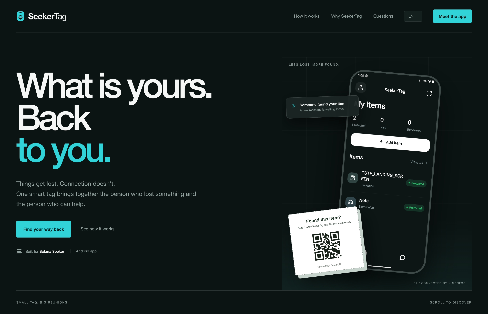

# SeekerTag

[](https://seekertag.vercel.app)

Lost & found for Solana Seeker: QR/NFC tags, private owner–finder conversations, and on-chain return rewards.

[Website](https://seekertag.vercel.app) · [Pitch deck (PDF)](https://github.com/minikas/seekertag/releases/download/v1.0.0-clock-in/seekertag-pitch.pdf) · [Download Android APK](https://github.com/minikas/seekertag/releases/download/v1.0.0-clock-in/SeekerTag-preview.apk) · [CLOCK IN release](https://github.com/minikas/seekertag/releases/tag/v1.0.0-clock-in)

The preview APK is a standalone Android ARM64 build for Seeker, configured to use the public SeekerTag API; Metro and a local backend are not required. The reward implementation supports devnet, testnet, and mainnet, with one network configured per server. The documented demo uses devnet test tokens.

Aplicativo **exclusivamente Android, com foco no Solana Seeker**, feito com Expo SDK 57 e React Native 0.86. Etiquetas QR/NFC ajudam a devolver objetos por conversa privada, sem expor os contatos do dono.

O projeto tem um app Android, uma API Node.js com SQLite e uma landing page institucional independente. Não há projeto iOS nem versão web do aplicativo. A API continua necessária para que dois aparelhos compartilhem objetos, avisos e mensagens.

## Landing page

`npm run dev:landing` abre o servidor em http://localhost:4320. A landing em português fica em `apps/landing/public`, sem dependências de runtime, fontes externas ou integração com a API. `LANDING_PORT` permite alterar a porta.

`npm run build:landing` gera `apps/landing/dist`, pronto para hospedagem estática. Para conferir esse resultado, execute `npm run preview --workspace=@seekertag/landing`. O servidor local fica restrito a loopback e não é um servidor de produção.

Os botões apresentam o status de desenvolvimento e permitem abrir `seekertag:///` em um Android com o app instalado. Não há link público de loja configurado. O celular apresenta uma captura real do app Android (`app-screen.png`). A etiqueta segue a apresentação do PDF do app, com um QR demonstrativo que abre `seekertag:///`, sem vincular um objeto real. A landing não altera o fluxo `/found` da API.

## Monorepo (Turborepo + npm workspaces)

Requer Node.js 24+ e npm 11.8.0. Execute `npm ci` uma única vez na raiz.

- `apps/mobile`: app Expo 57, assets, plugins, configuração EAS e testes mobile.
- `apps/api`: API Node/SQLite, testes e `.env` local; o banco fica em `apps/api/data/`.
- `apps/landing`: site institucional estático, responsivo e independente do app.
- `packages/shared`: pacote `@seekertag/shared`, usado pelo app e pela API.
- `contracts`, `scripts` e `artifacts`: contratos Solana, ferramentas e resultados de build na raiz.

Os comandos existentes continuam disponíveis na raiz: `npm run dev`, `npm run start`,
`npm run android`, `npm run api`, `npm run test:all`, `npm run build:android` e os testes de escrow/devnet.
`npm run dev` inicia API e Metro pelo Turbo; `npm run build` exporta o bundle Android para
`artifacts/android-bundle`. Testes sempre executam; typecheck e bundle usam cache do Turbo.
`EXPO_PUBLIC_*` e arquivos `.env` do app entram na chave do cache do bundle.
O desenvolvimento repassa as variáveis do terminal aos dois processos.

Para executar comandos diretamente no app, use `cd apps/mobile` antes de `npx expo …`
ou `eas …`; `app.json` e `eas.json` ficam nessa pasta. Os comandos da raiz encaminham
opções, por exemplo `npm run start -- --clear` e `npm run android -- --device Seeker`.
Após a migração, inicie o Metro uma vez com `--clear`. Antes de reutilizar builds nativos
incrementais, execute `npm run build:android` sem `--incremental` para atualizar os caminhos
nativos. Os diretórios nativos e artefatos locais existentes foram preservados.

Dependências são declaradas no workspace que as utiliza. Adicione pacotes com
`npm install <pacote> --workspace=@seekertag/mobile` ou `--workspace=seekertag-api`.
O lockfile único é `package-lock.json` na raiz; não instale a API com `--prefix`.
O Docker continua sendo construído a partir da raiz do repositório.

## Como funciona

1. O dono entra com sua carteira Seeker/Solana, Google ou Apple; a conta é criada no primeiro acesso. Google/Apple exigem ativação dos provedores. A tela inicial mostra a ilustração e a ação Começar; os três provedores ficam em um sheet Gorhom.
2. Cadastra um objeto, gera seu QR e compartilha/imprime o PDF ou grava uma etiqueta NFC.
3. Quem encontra usa o SeekerTag instalado para ler a etiqueta. **Não precisa criar conta**, mas precisa do aplicativo.
4. Envia um aviso e conversa com o dono. O acesso à conversa fica salvo no armazenamento seguro do aparelho.
5. O dono confirma a devolução. As conversas daquele objeto são encerradas e o histórico é atualizado.

Também existem busca, filtros, edição, arquivamento/restauração de objetos, marcação de perdido e transferência para outra conta com confirmação de identidade. Objetos arquivados saem das listas principais e ficam no filtro Arquivados; seus QRs e NFCs não recebem novos avisos até a restauração. A carteira usa Sign In With Solana via Mobile Wallet Adapter no Android.

## Categorias, idioma e aparência

Em **Minha conta → Categorias**, crie, renomeie e exclua categorias, escolhendo ícone e cor. O formulário de objeto também dá acesso ao gerenciamento sem perder o rascunho. Cada conta começa com Mochila, Mala, Chaves, Pet, Eletrônico e Outro. As categorias são próprias da conta e persistem na API; uma opção inicial excluída não reaparece. Se houver objetos nela, escolha a categoria de destino antes de excluir. Objetos, QRs e conversas são preservados. Até 50 categorias por conta.

Em **Minha conta → Idioma**, escolha Português, English, Español ou **Igual ao dispositivo** (padrão). Em **Aparência**, escolha Claro, Escuro ou **Igual ao dispositivo**. As escolhas são aplicadas imediatamente e salvas no aparelho, inclusive após fechar o app. Um idioma não suportado usa inglês. Os textos do app e das etiquetas PDF seguem o idioma escolhido; nomes, categorias personalizadas e mensagens escritos pelas pessoas mantêm seu conteúdo original.

A atualização migra os objetos existentes para categorias com IDs estáveis, mantendo seus códigos QR e cores. Categorias padrão usam chaves independentes do idioma; ao renomear uma delas, ela passa a ser um nome personalizado.

## Funcionalidades da antiga web no Android

| Funcionalidade | Implementação no aplicativo |
|---|---|
| Cadastro, login, logout e recuperação | Mesmas telas e API; sessão no SecureStore |
| Criar e editar objetos, categoria, nota privada, mensagem pública e recompensa | Formulário completo de objeto |
| Busca, filtros e indicadores | Indicadores da home abrem a lista filtrada; busca em Ver todos |
| Marcar perdido, arquivar e restaurar | Detalhes da etiqueta |
| QR, leitura por câmera e entrada manual | QR nativo e leitor Expo |
| Compartilhar link | Compartilhador Android |
| Baixar PDF A4 com seis etiquetas | Seletor de pasta Android e arquivo persistente |
| Compartilhar/imprimir PDF | Compartilhar PDF com o aplicativo de arquivos/impressão escolhido |
| Ver etiqueta como visitante | Abre no SeekerTag; o dono vê uma prévia sem formulário de aviso |
| Gravar/cancelar NFC | NDEF nativo; exige hardware e etiqueta compatíveis |
| Entrar com Seeker/Solana e vincular acessos | Assinatura SIWS verificada pela API; Google/Apple após configuração |
| Aviso anônimo e conversa nos dois sentidos | Mesmas telas e API; credencial do visitante no SecureStore |
| Voltar à conversa após fechar | Releitura da etiqueta ou link no mesmo aplicativo |
| Confirmar devolução e atualizar histórico/contadores | Conversas do dono e API |
| Transferir objeto com confirmação de identidade | Senha existente ou novo login por carteira/provedor; destino por e-mail, carteira ou ID |
| Falha de rede e reenvio | Erro visível e rascunho preservado enquanto a tela está aberta |
| Etiqueta inválida/pausada e conversa sem credencial | Estados de erro e retorno ao início |

A visita sem conta foi preservada dentro do Android. A abertura sem instalar aplicativo deixou de existir com a remoção da web. Recompensas com depósito, renovação e pagamento foram acrescentadas no Android; notificações push continuam fora do escopo.

## Recompensas com reserva

Em **Adicionar/Editar objeto**, a seção **Recompensa** reúne saldo, SOL/USDC/SKR, valor com máscara e botões −/+ e prazo em horas, dias, meses ou anos. O limite é de 1 hora a 5 anos; mês = 30 dias e ano = 365 dias. **Salvar e revisar depósito** abre a revisão no mesmo Gorhom, com valor, vencimento, taxa de rede e custo das contas antes da assinatura na carteira. Um valor preenchido no formulário continua sendo apenas anunciado até o depósito ser confirmado com compromisso `finalized`.

**Renovar reserva** acrescenta o período escolhido ao prazo atual (ou a partir de hoje se já venceu), sem retirar nem depositar o valor novamente. O prazo total não pode ultrapassar 5 anos a partir de hoje. **Cancelar e recuperar** só funciona depois do vencimento e devolve o saldo à carteira original; o vencimento não movimenta fundos automaticamente.

Na conversa, quem encontrou confirma uma carteira com assinatura de mensagem. Após receber o objeto, o dono escolhe **Devolução e recompensa → Confirmar devolução e pagar** e assina a transação. A API também assina a carteira destinatária verificada e só encerra a devolução após confirmar o pagamento na rede. Antes do vencimento, não existe cancelamento antecipado pelo dono ou pelo servidor.

A integração é inicialmente **devnet**. USDC e SKR usados pelos scripts são tokens de teste próprios, com 6 casas decimais; não são os ativos reais nem representam saldo mainnet. Detalhes de contrato, recuperação de transações, configuração e testes estão em [apps/api/REWARDS.md](apps/api/REWARDS.md).

## Executar no celular

Requer Node.js 24, npm e uma compilação de desenvolvimento instalada no aparelho ou emulador.

```sh
npm ci
npm run dev:lan
```

Esse comando detecta o IP local, inicia a API na porta 4318 e o Metro para o app nativo. Os aparelhos precisam alcançar o computador pela rede. `SEEKERTAG_LAN_HOST` permite escolher o IP. `PORT`, `PUBLIC_URL` e `EXPO_PUBLIC_API_URL` podem sobrescrever a configuração.

Para instalar o app pela primeira vez, use outro terminal e o endereço mostrado pelo comando anterior:

```sh
EXPO_PUBLIC_API_URL=http://IP-DO-COMPUTADOR:4318/api npm run android
```

`npm run start` inicia somente o Metro; `npm run api` inicia somente a API; `npm run api:lan` inicia a API com o IP local configurado para as etiquetas. `npm run dev` inicia API e Metro usando o ambiente atual. Não execute dois servidores na mesma porta.

`npm ci` também aplica uma correção de compatibilidade do Keyboard Controller 1.21.9 com a barra de status do React Native 0.86: a cor dos ícones acompanha o tema mesmo dentro de telas modais. A correção está em `scripts/patch-android-statusbar.cjs` e deve ser revisada ao atualizar a biblioteca.

NFC e carteira precisam de uma compilação nativa compatível. Expo Go não substitui essa compilação. Não há conta padrão nem dados simulados no produto.

## Configuração do ambiente

Copie `apps/api/.env.example` para `apps/api/.env`. Esse arquivo é local, ignorado pelo Git e carregado por `npm run api`. O aplicativo recebe somente variáveis `EXPO_PUBLIC_*`; qualquer valor com chave privada ou `SECRET` deve existir apenas no servidor.

| Variável | Obrigatória | Como definir ou obter |
|---|---:|---|
| `PORT` | Não | Porta local da API; padrão `4318`. |
| `HOST` | Não | Interface de escuta. Use `0.0.0.0` em contêiner/LAN ou `127.0.0.1` para acesso apenas local. |
| `PUBLIC_URL` | Produção | Origem pública estável da API, sem `/api`, por exemplo `https://api.exemplo.com`. É usada nos QRs, callbacks e links. |
| `DATABASE_PATH` | Não | Caminho persistente do SQLite. Monte esse arquivo/volume e faça backup em produção. |
| `CORS_ORIGINS` | Só para clientes web extras | Lista de origens HTTPS separadas por vírgula. O app Android nativo não precisa dela. |
| `GOOGLE_CLIENT_ID` / `GOOGLE_CLIENT_SECRET` | Só para Google | Crie um cliente OAuth **Web application** no Google Cloud e registre o callback indicado abaixo. |
| `APPLE_CLIENT_ID` | Só para Apple | Services ID criado no Apple Developer e associado a um App ID com Sign in with Apple. |
| `APPLE_TEAM_ID` | Só para Apple | Team ID exibido na conta Apple Developer. |
| `APPLE_KEY_ID` / `APPLE_PRIVATE_KEY` | Só para Apple | ID e conteúdo da chave `.p8` criada para Sign in with Apple. Use `\n` literais no `.env`. |
| `REWARD_NETWORK` | Para recompensas on-chain | `devnet`, `testnet`, `mainnet` ou `localnet`. Comece por `devnet`. |
| `REWARD_RPC_URL` | Para recompensas on-chain | Endpoint HTTPS de um provedor RPC da rede escolhida. Os endpoints públicos servem para testes; produção deve usar um RPC privado com SLA. |
| `REWARD_VERIFIER_KEYPAIR` | Para recompensas on-chain | Caminho absoluto para a hot key do verificador. Gere fora do repositório com `solana-keygen new --outfile /caminho/seguro/verifier.json`. |
| `REWARD_TREASURY` | Para recompensas on-chain | Apenas o endereço público de uma carteira Solana separada, preferencialmente hardware wallet ou multisig. A chave privada não deve ficar na API. |
| `REWARD_FEE_BPS` | Não | Comissão das novas reservas em basis points: `500` = 5%. Intervalo permitido: 1–1000. |
| `REWARD_LEGACY_VERIFIER_KEYPAIRS` | Só durante rotação | Caminhos das chaves antigas separados por vírgula. Deixe vazio na primeira instalação. |
| `REWARD_TEST_USDC_MINT` / `REWARD_TEST_SKR_MINT` | Só para tokens de teste | Endereços públicos dos mints criados na rede de teste. `node scripts/devnet-rewards.mjs init` cria/configura os fixtures de devnet. |
| `REWARDS_ALLOW_MAINNET` | Só em mainnet | Precisa ser exatamente `true` depois da publicação e revisão do contrato em mainnet. |
| `EXPO_PUBLIC_API_URL` | No build do aplicativo | URL pública da API com `/api`, por exemplo `https://api.exemplo.com/api`. É embutida no APK e nunca deve conter segredo. |

Para desabilitar depósitos on-chain, deixe `REWARD_VERIFIER_KEYPAIR` vazio. Google e Apple também são opcionais: cada botão só é habilitado quando todas as variáveis daquele provedor estão presentes. A referência detalhada da API está em [apps/api/API.md](apps/api/API.md#configuração), e contrato, RPC, mints, publicação e rotação estão em [apps/api/REWARDS.md](apps/api/REWARDS.md#configuração).

## Acesso por carteira, Google e Apple

A tela inicial unifica cadastro e entrada. **Continuar com Seeker / Solana** pede uma assinatura de login, sem transação ou taxa. A API gera o domínio, nonce e prazo de cinco minutos e verifica a assinatura Ed25519; o mesmo pedido não cria duas sessões. A carteira precisa suportar Sign In With Solana. Isso autentica a carteira, sem atestar que o aparelho é um Seeker ou verificar um Seeker Genesis Token.

Em **Minha conta → Formas de entrar**, vincule uma carteira ou provedor à conta atual para preservar seus objetos. Contas com o mesmo e-mail nunca são unidas automaticamente. Contas por carteira podem não ter e-mail; o ID da conta e o endereço Solana também servem para receber etiquetas. Transferências de contas sem senha exigem nova confirmação, válida por cinco minutos e para uma única transferência.

Google e Apple usam a autenticação oficial em uma aba do navegador Android e retornam ao aplicativo. Só são habilitados quando a API tem as credenciais completas e `PUBLIC_URL` HTTPS. Sem essa configuração, aparecem como **Em breve**. Nenhum projeto web ou iOS é necessário no repositório; os callbacks pertencem à API.

Para ativar, configure o ambiente da API (ou `apps/api/.env`, carregado por `npm run api`); os nomes estão em [apps/api/.env.example](apps/api/.env.example). Não coloque segredos em `EXPO_PUBLIC_*` ou no aplicativo:

1. **Google:** configure a tela de consentimento e um cliente OAuth do tipo **Web application**, pois a troca de código acontece na API. Registre `https://SEU-DOMINIO/api/auth/oauth/google/callback` e configure `GOOGLE_CLIENT_ID` e `GOOGLE_CLIENT_SECRET`. Enquanto o projeto estiver em teste, adicione suas contas de teste no Google Cloud.
2. **Apple:** configure um Services ID associado a um App ID elegível com Sign in with Apple, seu domínio e `https://SEU-DOMINIO/api/auth/oauth/apple/callback`. Configure `APPLE_CLIENT_ID`, `APPLE_TEAM_ID`, `APPLE_KEY_ID` e `APPLE_PRIVATE_KEY` com a chave `.p8`. A elegibilidade e associação a um aplicativo Apple são requisitos da conta Apple Developer; remover o projeto iOS deste repositório não elimina esses requisitos.
3. Use a mesma origem HTTPS em `PUBLIC_URL` e `EXPO_PUBLIC_API_URL` (com `/api` no aplicativo), reinicie a API e recarregue o app. Teste consentimento, cancelamento e retorno em cada provedor antes de publicar.

Os callbacks validam estado, nonce, assinatura, emissor, destinatário e validade do token. O retorno `seekertag://auth/callback` contém apenas um código temporário, vinculado ao segredo de prova mantido no aplicativo; os tokens dos provedores e a sessão SeekerTag não trafegam nesse link. Cancelar não cria conta. A interface não oferece login por e-mail. Erros de entrada aparecem em toasts temporários.

Referências: [Sign In With Solana](https://docs.solanamobile.com/get-started/react-native/invoke-mwa-sessions-directly#sign-in-with-solana), [Google OpenID Connect](https://developers.google.com/identity/openid-connect/openid-connect), [Apple em outras plataformas](https://developer.apple.com/documentation/signinwithapple/incorporating-sign-in-with-apple-into-other-platforms), [configuração Apple](https://developer.apple.com/help/account/capabilities/configure-sign-in-with-apple-for-the-web), [Expo WebBrowser SDK 57](https://docs.expo.dev/versions/v57.0.0/sdk/webbrowser/).

## Seeker conectado por USB no macOS

Com a depuração USB autorizada e o Seeker aparecendo como `device` em `adb devices`, encaminhe as portas pelo cabo:

```sh
adb reverse tcp:4318 tcp:4318
adb reverse tcp:8081 tcp:8081
```

Em um terminal, inicie a API:

```sh
HOST=127.0.0.1 PUBLIC_URL=http://127.0.0.1:4318 npm run api
```

Em outro, inicie o servidor de desenvolvimento. A opção de DNS mantém o Metro em IPv4 para o encaminhamento USB:

```sh
NODE_OPTIONS=--dns-result-order=ipv4first \
EXPO_PUBLIC_API_URL=http://127.0.0.1:4318/api npm run start -- --localhost
```

Para compilar e instalar no Seeker, use um terceiro terminal:

```sh
JAVA_HOME=$(/usr/libexec/java_home -v 17) \
EXPO_PUBLIC_API_URL=http://127.0.0.1:4318/api \
npm run android -- --device Seeker --no-bundler
```

Para abrir o projeto instalado pelo USB:

```sh
adb shell am start -a android.intent.action.VIEW \
  -d 'exp+seekertag://expo-development-client/?url=http%3A%2F%2F127.0.0.1%3A8081' \
  app.seekertag.mobile
```

Mantenha API, Metro e cabo conectados durante o teste. Repita os dois comandos `adb reverse` após reconectar o aparelho. Se houver mais de um Android conectado, acrescente `-s SERIAL` depois de `adb`. As etiquetas com endereço `127.0.0.1` funcionam somente nos aparelhos com esse encaminhamento; use a configuração de rede local para testar entre celulares.

## Links das etiquetas

Os QRs e as etiquetas NFC mantêm o formato `PUBLIC_URL/found/CODIGO`. O leitor dentro do app abre esses links diretamente. Ao acessar esse endereço externamente, a API responde com um redirecionamento para `seekertag:///found/CODIGO?origin=ORIGEM`; não entrega HTML. A opção **Ver como visitante**, no menu **⋯** do objeto, abre o fluxo no próprio app.

O app valida a origem do link contra `EXPO_PUBLIC_API_URL`. Configure `PUBLIC_URL` como a origem dessa API, sem `/api`, e use o mesmo endereço nos builds. Links não podem mudar o servidor ao qual o aplicativo se conecta. Conversas exigem a credencial salva no aparelho, mesmo quando abertas por link.

Abrir o redirecionamento depende do suporte do leitor/navegador a esquemas de aplicativo e do SeekerTag instalado. Sem o app não há página alternativa. A leitura dentro do app é o caminho suportado para testar as etiquetas. Android App Links verificados e encaminhamento para lojas não estão configurados.

Use um domínio HTTPS estável antes de imprimir etiquetas definitivas. Links antigos continuam dependendo do endereço original: se foram emitidos com a porta 8081 da versão web, reemita as etiquetas para a origem da API ou mantenha esse endereço encaminhado e configure o app para a mesma origem. Os códigos dos objetos e o banco não precisam mudar.

## API e hospedagem

```sh
PUBLIC_URL=https://seu-dominio.example npm run api
```

Nos builds, use `EXPO_PUBLIC_API_URL=https://seu-dominio.example/api`. Substitua o domínio de exemplo por um domínio real. O banco padrão fica em `apps/api/data/seekertag.sqlite`, acompanhado dos arquivos WAL/SHM.

O Docker empacota somente o backend:

```sh
docker build -t seekertag-api .
docker run --rm -p 4318:4318 -v seekertag-data:/data \
  -e PUBLIC_URL=https://seu-dominio.example seekertag-api
```

Use HTTPS no proxy e armazenamento persistente com backup. Nenhum serviço é publicado automaticamente. Rotas e contratos estão em [apps/api/API.md](apps/api/API.md).

## Build Android

Android exige JDK 17 e Android SDK/NDK:

```sh
EXPO_PUBLIC_API_URL=https://seu-dominio.example/api npm run build:android
```

O script gera `artifacts/SeekerTag-preview.apk`, arm64, com assinatura de desenvolvimento e JavaScript embutido. Sem URL explícita, tenta detectar a rede local. `-- --incremental` pode ser usado após mudanças somente em JavaScript/TypeScript. O plugin Android permite HTTP para desenvolvimento; ajuste `allowCleartext: false` em `apps/mobile/app.json` para distribuição com API HTTPS.

`eas.json` mantém os perfis Android development, preview APK e production AAB. APKs produzidos antes desta mudança precisam ser recompilados. Não há alvo, configuração ou script de build iOS.

Referências: [Expo SDK 57](https://docs.expo.dev/versions/v57.0.0/), [plataformas e esquema do app](https://docs.expo.dev/versions/v57.0.0/config/app/), [abertura por links](https://docs.expo.dev/linking/into-your-app/).

## Testes

```sh
# TypeScript, unidades e integração HTTP com SQLite isolado:
npm run test:all

# Individualmente:
npm run typecheck
npm run test:unit
npm run test:api
# Compila o contrato SBF e executa a VM e a integração HTTP/RPC:
npm run test:escrow
```

Os testes verificam autenticação, privacidade, devolução, transferência, recuperação, persistência, PNG/PDF, limites de requisições e abertura de links Android. Os testes unitários do adaptador de PDF executam sua lógica real com as interfaces nativas de arquivos e compartilhamento substituídas por implementações em memória; não equivalem a testes em aparelho. A suíte de navegador foi removida junto com o frontend web.

Para testar a interface, instale o build atual em um emulador ou aparelho Android iniciado e execute Maestro contra uma API de teste:

```sh
NATIVE_DEVICE_ID=emulator-5554 \
EXPO_PUBLIC_API_URL=http://IP-DO-COMPUTADOR:4318/api npm run test:android
```

Antes de executar, entre no app com uma conta exclusiva de QA via um provedor suportado e disponibilize sua sessão na variável privada `NATIVE_QA_OWNER_TOKEN`. O fluxo não efetua login nem aprova a carteira. Esse comando usa essa sessão e cria uma conta de fixture e objetos na API indicada; não inicia um servidor isolado. A URL deve coincidir com a embutida no app. Use um aparelho de teste em português ou selecione Português no app antes desse fluxo. Ele verifica a sessão existente, criação de objeto, compartilhamento nativo do link, prévia do dono sem envio de aviso, cancelamento do seletor de pasta do PDF, QR manual, aviso, persistência e links com o app aberto/fechado. Os objetos e avisos são conferidos também na API. Evidências ficam em `artifacts/native-android/`. Os fluxos estão em `apps/mobile/tests/android/`. Câmera óptica, gravação NFC e autorização da carteira devem ser conferidas em aparelho compatível.

Para conferir o teclado sem criar dados, selecione Português em Idioma, comece no painel com a conta conectada e execute `maestro test apps/mobile/tests/android/form-keyboard.yaml`. O fluxo abre um rascunho, alterna entre recompensa e mensagem, verifica que dispensar o teclado mantém a seção visível e fecha sem salvar. Para avaliar fluidez, use o APK de `build:android`, que inclui o JavaScript otimizado; o cliente de desenvolvimento com Metro tem custo adicional de depuração.

Para conferir o menu do objeto e cancelar NFC sem alterar dados, mantenha NFC ativado e execute `maestro test -e QA_OBJECT_NAME="Nome do objeto" apps/mobile/tests/android/tag-details.yaml`. O fluxo usa uma etiqueta existente e verifica nova tentativa e fechamento pelo Voltar do Android.

O fluxo `apps/mobile/tests/android/owner-preview.yaml`, com o mesmo `QA_OBJECT_NAME`, abre a prévia pelo menu do objeto e verifica que o dono não recebe formulário nem botão para avisar a si mesmo. A API também rejeita a criação de aviso pela sessão do dono.

`apps/mobile/tests/android/home-browse.yaml` confere busca, filtros e retorno do editor; `apps/mobile/tests/android/home-account.yaml` confere os indicadores, a ajuda e a navegação de Minha conta. Use `QA_OBJECT_NAME` de um objeto protegido e uma conta sem conversas para esses fluxos, que não salvam dados nem saem da conta.

Minha conta é uma tela normal, sem navegação inferior. Aparência, Idioma e Receber etiquetas abrem sheets Gorhom ajustados ao conteúdo, mantendo a posição da tela ao fundo. Selecionar idioma/tema salva a preferência e fecha o sheet; arrastar para baixo, tocar fora ou usar Voltar apenas fecha. Formas de entrar e o gerenciamento de categorias continuam em telas próprias.

O fluxo `apps/mobile/tests/android/preferences-categories.yaml` começa com a conta conectada e verifica os três idiomas, troca de tema, persistência após reabrir e criação/edição/exclusão de uma categoria temporária. Execute com `maestro test -e QA_CATEGORY=QA-NOME-UNICO apps/mobile/tests/android/preferences-categories.yaml`; ele não cria nem altera objetos. Termina com Português/Escuro para permitir o teste de teclado. Depois, restaure suas preferências em Minha conta.

`npm run build:bundle` confirma que o JavaScript empacota para Android; não substitui testes no aparelho, compilação do binário ou testes físicos de câmera/NFC/carteira.

## Verificador, treasury e comissão

O verificador é uma hot key do serviço que coassina pagamentos confirmados pelo dono; a treasury é uma carteira independente que recebe a comissão e pode permanecer fria. Configure `REWARD_VERIFIER_KEYPAIR` com o caminho privado do verificador, `REWARD_TREASURY` apenas com o endereço público da treasury e `REWARD_FEE_BPS=500` para 5%. O depósito grava verificador, treasury e percentual no recibo on-chain, portanto alterações posteriores valem somente para reservas novas.

A rede também é configuração do servidor, não uma preferência do usuário: use `REWARD_NETWORK=devnet`, `testnet`, `mainnet` ou `localnet` junto de `REWARD_RPC_URL`. Cada instância atende uma única rede e precisa encontrar nela o programa publicado. “Minha conta → Rede” mostra qual rede está ativa; treasury, verificador e programa permanecem detalhes internos da infraestrutura. Para oferecer várias redes, publique instâncias separadas da API (com bancos, RPCs, chaves e URLs próprias) e distribua builds apontando para a instância desejada; não misture reservas de redes diferentes no mesmo serviço.

Para trocar a treasury, altere `REWARD_TREASURY` e reinicie a API. Para rotacionar o verificador sem interromper reservas abertas, mova o caminho antigo para `REWARD_LEGACY_VERIFIER_KEYPAIRS` (lista separada por vírgulas), coloque a chave nova em `REWARD_VERIFIER_KEYPAIR` e reinicie. Remova uma chave antiga somente quando todas as reservas vinculadas a ela estiverem encerradas. A configuração completa e os cuidados operacionais estão em [`apps/api/REWARDS.md`](apps/api/REWARDS.md#rotação-segura).

## Limites atuais

- Depósitos SOL/USDC/SKR estão preparados para devnet. Mainnet exige publicação e ativação próprias; tokens de teste não têm valor real. Alias `.skr` verificado e verificação SGT não estão implementados.
- Não há push ou envio de e-mail. Conversas são atualizadas periodicamente enquanto o app está aberto.
- Etiquetas são passivas e não rastreiam localização.
- Mensagens são privadas por autorização da API, sem criptografia ponta a ponta. O operador do servidor controla o banco.
- Sessões e credenciais do visitante usam SecureStore. Apagar os dados pode remover o acesso à conversa.
- NFC físico, autorização de carteira, publicação nas lojas e hospedagem pública exigem validação própria.

## Estrutura

| Caminho | Responsabilidade |
|---|---|
| `apps/mobile/App.tsx`, `apps/mobile/src/` | Interface mobile, conta, objetos e conversas |
| `apps/mobile/src/links.ts` | Validação de links e abertura no app |
| `apps/mobile/src/platform/` | Câmera, SecureStore, PDF, NFC e carteira nativos |
| `apps/api/` | API, SQLite, QR/PDF e redirecionamentos para o app |
| `packages/shared/` | Tipos, validações e instruções de escrow compartilhados |
| `turbo.json`, `package.json` | Tarefas Turbo e workspaces npm |
| `scripts/` | Desenvolvimento na rede, builds e testes nativos |
| `apps/mobile/tests/unit/`, `apps/api/test/`, `apps/mobile/tests/android/` | Testes unitários, de API e de interface mobile |
